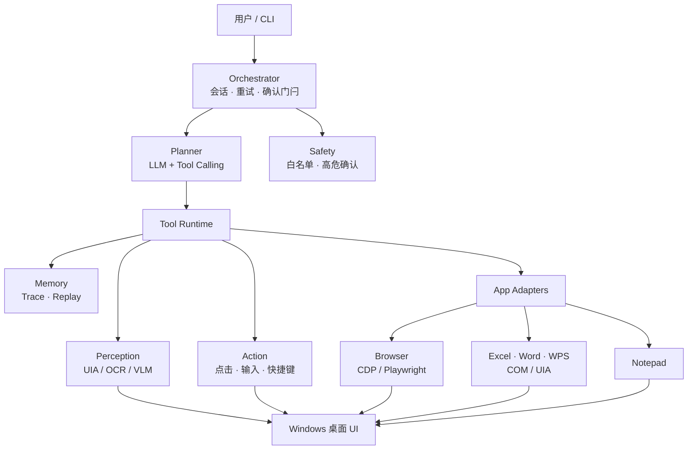

# Desktop Agent

Windows 桌面 UI Agent：用自然语言描述任务，在本机自动完成浏览器与办公软件上的点击、输入、填表、保存等操作。

适合场景：记事本写文件、Edge/Chrome 打开网页并填表、Excel/Word/WPS 读写与保存，以及下载栏 /「另存为」等常见对话框流程。

> 平台：Windows 10 / 11 · Python 3.11+ · 交互方式：CLI  
> 详细设计见 [docs/technical-design.md](docs/technical-design.md)

---

## 项目做什么

用户给出一句目标（例如「打开记事本，输入 hello，另存为到桌面」），Agent 会：

1. **感知**当前桌面 UI（窗口、控件、文本）
2. **规划**可执行步骤（LLM tool-calling）
3. **执行**点击、输入、快捷键或应用专用 API（浏览器 DOM / Office COM）
4. **校验**结果；失败可重试或询问用户
5. **记录**步骤与截图，便于回放排查

设计原则：**结构感知优先（UIA / DOM / COM），OCR/VLM 仅作兜底**；高危操作需确认；默认可操作应用白名单。

### 架构概览



数据流简述：CLI 下达任务 → Orchestrator 编排 → Planner 选工具 → Tool Runtime 调用感知/动作/适配器操作桌面，全程写入 Trace。

---

## 功能一览

| 能力 | 说明 |
|---|---|
| 自然语言任务 | `run "…"`，由 LLM Orchestrator 编排多步工具调用 |
| 桌面感知 | 列举窗口、感知前景 UI 树；支持截图 |
| 基础交互 | 点击、输入、快捷键、等待条件、通用「另存为」对话框 |
| 视觉兜底 | OCR 找字；可选多模态 VLM 定位（需视觉模型） |
| 浏览器 | CDP Attach 日常 Edge/Chrome；失败可降级到受控浏览器 |
| Office | Excel / Word（COM）；WPS 表格与文字读写、保存 |
| 记事本 | 输入与另存为闭环，可用 `verify_file` 验落盘 |
| 安全策略 | 应用白名单、高危确认、密码脱敏、本地 Trace |
| 回放与评测 | `replay` 只读回放；T01–T12 与 LLM e2e 套件 + 汇总看板 |

**白名单应用（默认）**：Edge、Chrome、Excel、Word、记事本、WPS（见 `configs/apps.whitelist.yaml`）。

---

## 环境要求

- Windows 10 / 11
- Python 3.11+
- 使用自然语言任务时：可用的 LLM API Key（OpenAI 兼容，默认 DeepSeek）
- 浏览器相关任务：建议用调试模式启动浏览器，或依赖受控模式降级
- Excel / Word / WPS：本机已安装对应软件

---

## 安装

```powershell
# 建议使用虚拟环境
py -m venv .venv
.\.venv\Scripts\Activate.ps1

# 开发模式安装
py -m pip install -e .

# 可选：OCR 视觉兜底
py -m pip install -e ".[vision]"

# 可选：开发依赖
py -m pip install -e ".[dev]"
```

若 `desktop-agent` 不在 PATH，一律用模块方式调用：

```powershell
py -m desktop_agent --help
```

---

## 配置

### 1. API Key

在项目根目录创建 `.env`（已 gitignore），可参考 `.env.example`：

```env
DESKTOP_AGENT_API_KEY=sk-...
```

也可直接设置同名环境变量。

### 2. Agent 配置

主配置：`configs/agent.yaml`

- **LLM**：默认 `deepseek-v4-flash` @ `https://api.deepseek.com`
- **浏览器**：`mode: attach`（模式 B）；`fallback_to_controlled: true` 时 Attach 失败自动降级模式 A
- **感知**：`enable_ocr_fallback` 默认开启；`enable_vlm_fallback` 默认关闭（文本模型无需开）
- **安全**：白名单、坐标点击 / 提交确认等

代理导致 LLM TLS 异常时，可在 `.env` 设置：

```env
DESKTOP_AGENT_HTTP_TRUST_ENV=0
```

---

## 快速开始

### 环境自检

```powershell
py -m desktop_agent doctor
```

会检查 UIA、DPI、浏览器 CDP、Excel/Word/WPS、LLM、OCR/VLM、traces 目录等。

### 跑一条自然语言任务

```powershell
# --yes：自动确认高危提示，避免交互卡住（自动化/评测推荐）
py -m desktop_agent run "打开记事本，输入 hello，然后告诉我完成了" --yes

# 限制最大步数
py -m desktop_agent run "用 Chrome 打开 https://example.com 并截个快照" --yes --max-steps 12
```

更多例子：

```powershell
.\.venv\Scripts\python.exe -m desktop_agent run "打开记事本，输入 hello，然后告诉我完成了" --yes

.\.venv\Scripts\python.exe -m desktop_agent run "google 打开 https://www.bilibili.com，在 B站顶部搜索框 填入凡人修仙传 来搜索动漫观看" --yes --max-steps 12
```

任务日志写在 `traces/<task_id>/`（含 `events.jsonl` 与截图）。运行过程中会打印 `LOG_DIR`；结束后可用 `replay` 查看。

### 感知与单步操作（无需 LLM）

```powershell
py -m desktop_agent list-windows
py -m desktop_agent sense --dump ui.json
py -m desktop_agent click --name "确定"
py -m desktop_agent type-text "hello" --name "编辑"
py -m desktop_agent press-keys ctrl s
```

### 浏览器

```powershell
# Attach 模式：用调试端口启动日常浏览器
powershell -File scripts/start-browser-debug.ps1 -Browser edge

py -m desktop_agent browser-probe
py -m desktop_agent browser-open "https://example.com"
```

### Office 快捷命令

```powershell
py -m desktop_agent excel-set A1 "销售额"
py -m desktop_agent excel-get A1
```

### Trace 回放

```powershell
py -m desktop_agent replay traces\你的任务目录
py -m desktop_agent replay traces\你的任务目录 --summary
py -m desktop_agent replay traces\你的任务目录 --type tool_call --json
```

---

## 常用 CLI

| 命令 | 作用 |
|---|---|
| `doctor` | 环境健康检查 |
| `run "<目标>"` | 自然语言任务（需 LLM） |
| `list-windows` / `sense` | 列窗口 / 感知前景 UI |
| `click` / `type-text` / `press-keys` | 单步桌面操作 |
| `browser-probe` / `browser-open` | 浏览器探测与导航 |
| `excel-set` / `excel-get` | Excel COM 读写 |
| `replay <trace>` | 只读回放任务轨迹 |
| `eval-*` / `eval-dashboard` | 闭环评测与汇总 |

完整参数：`py -m desktop_agent <command> --help`。

---

## 评测（可选）

无 LLM 脚本闭环（以磁盘/DOM 为准）与 LLM e2e 均可通过 CLI 触发。

**LLM e2e（默认 `--yes`）：**

```powershell
py -m desktop_agent eval-llm-t01   # 记事本另存为
py -m desktop_agent eval-llm-t02   # Edge 填表
py -m desktop_agent eval-llm-t03   # Chrome 填表
py -m desktop_agent eval-llm-t04   # Excel
py -m desktop_agent eval-llm-t05   # Word
py -m desktop_agent eval-dashboard --llm-suite
```

**无 LLM 套件（节选）：**

```powershell
py -m desktop_agent eval-t01
py -m desktop_agent eval-t02
py -m desktop_agent eval-t03 --force-controlled
py -m desktop_agent eval-t04
py -m desktop_agent eval-t05
# … T06–T12 见 py -m desktop_agent --help
py -m desktop_agent eval-dashboard --suite
```

---

## OCR / VLM 说明

配置项在 `configs/agent.yaml` 的 `perception.*`：

- `enable_ocr_fallback: true` — 需 `pip install -e ".[vision]"`（RapidOCR）；也可走 Windows.Media.Ocr
- `enable_vlm_fallback` — 需多模态模型；默认 DeepSeek 文本模型时请保持关闭

OCR/VLM 命中的元素走坐标点击，默认需要确认（`--yes` 可自动通过）。

---

## 项目结构（简要）

```text
src/desktop_agent/     # 主代码：CLI / Orchestrator / Planner / Tools / Adapters
configs/               # agent.yaml、白名单、各应用 adapter
evals/runners/         # 闭环评测脚本
docs/                  # 技术方案
traces/                # 本地任务轨迹（运行时生成）
scripts/               # 浏览器调试启动等辅助脚本
```

---

## 非目标（当前不做）

- 游戏 / 纯自绘 Canvas 的通用自动化
- 跨机器远程控制
- 无监督高危操作（支付、批量删除、系统设置变更）
- macOS / 移动端
